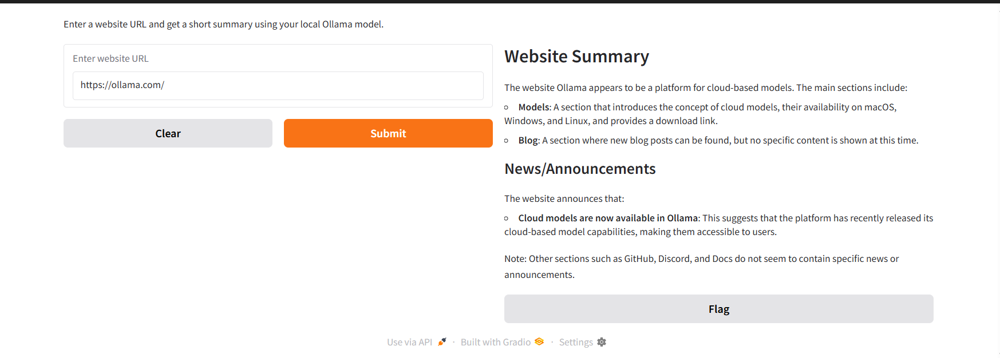

# 🦙 Local Ollama Website Summarizer

This project demonstrates a **local website summarizer** powered by **Ollama** using a **LLaMA model (llama3.2)** and a simple **Gradio web interface**.

---

## 🚀 Features

- 🧠 **Content Extraction** – Fetches and cleans the main text content from any URL.  
- 🧹 **Noise Removal** – Automatically removes unnecessary elements (scripts, images, styles, inputs).  
- 📝 **Structured Summaries** – Produces short, readable summaries in **Markdown** format.  
- ⚙️ **Offline & Local** – Runs entirely on your machine using the local **LLaMA model** for privacy and speed.  
- 🔄 **Future Improvements** – Planned support for real-time **streaming summaries**.

---

## 🧩 Project Overview

This tool is ideal for quickly understanding web articles, documentation, or blogs without needing online AI APIs.  
Simply enter a URL, and the app fetches, cleans, and summarizes the main content using your local Ollama setup.

---

## 🖥️ Interface Preview

### 1️⃣ Empty Interface (Before Input)
When you first open the app, you'll see a simple Gradio interface with an input box where you can paste a URL.


---

### 2️⃣ With Summarization (After Processing)
After submitting a URL, the app fetches the content, processes it, and displays a concise summary generated by the **LLaMA model**.




---

## ⚡ Quick Start

1. **Install Ollama** (if not already):  
   👉 [https://ollama.ai/download](https://ollama.ai/download)

2. **Run your LLaMA model locally:**  
   ```bash
   ollama run llama3.2
